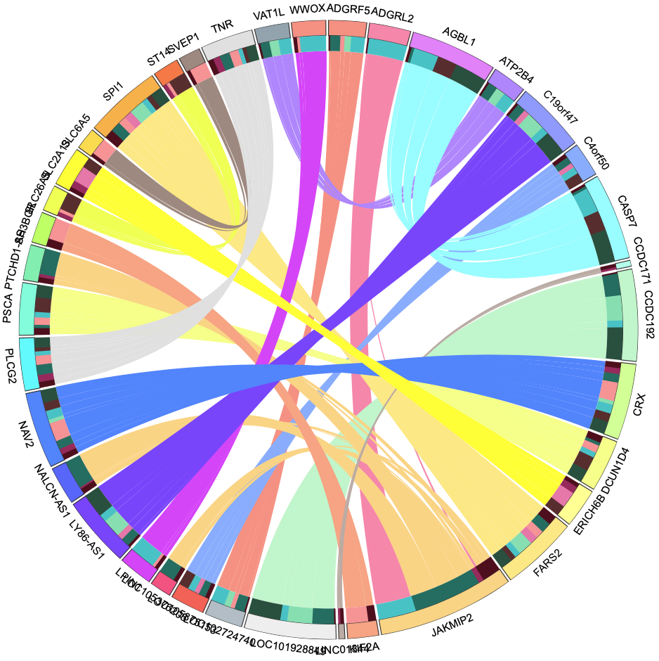

# circosPlot
Circos plot of gene interactions using the effect size and individual genotypes within each allele. 

This plot was generated using pycircos found here: https://github.com/ponnhide/pyCircos. 

# Outer ring
Alleles with width set as the summed effect sizes from every SNP in allele.

# Middle ring
Heatmap of the genotype effect sizes within each allele (AA, BB, CC, AB,... etc)

# Inner circle
Weighted effect sizes (epistatic interactions) between the alleles and subsequently the genotypes within those alleles

# Test Plot

I'd like to figure out how to rotate the gene labels to 90 degrees from node and add a figure legend for the haplotype heatmap

